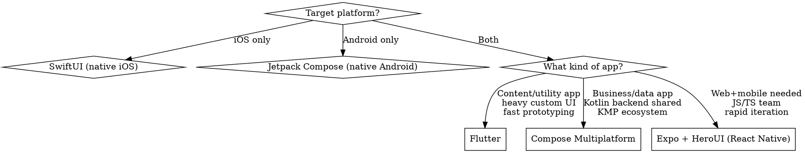

# Mobile App Builder

Build production-ready mobile app infrastructure from day one. Based on patterns from developers shipping 10+ revenue-generating apps ($800K+/yr across 10 apps). Covers the full lifecycle: validation, platform selection, building, onboarding, monetization, and go-to-market.

## When to Use

- Starting a new mobile app project (any platform)
- Setting up app infrastructure (auth, payments, analytics, crash reporting)
- Scaffolding a subscription-based mobile app with paywall
- Choosing between native, cross-platform, or multiplatform frameworks
- Validating a mobile app idea before building
- Planning go-to-market for a mobile app

## FIRST: Ask the Platform Target

**Before writing any code, ask the user which platform(s) they're targeting.** Then follow the decision tree:



### Platform Quick Reference

| Platform | Language | UI Framework | Best For | Tradeoffs |
|----------|----------|-------------|----------|-----------|
| **SwiftUI** | Swift | SwiftUI | iOS-only apps, Apple ecosystem deep integration | iOS only, Apple lock-in |
| **Jetpack Compose** | Kotlin | Compose | Android-only apps, Material Design, Google ecosystem | Android only |
| **Flutter** | Dart | Flutter widgets | Cross-platform with heavy custom UI, rapid prototyping | Large binary size, Dart ecosystem smaller |
| **Compose Multiplatform** | Kotlin | Compose | Shared Kotlin logic, KMP ecosystem, business/data apps | Newer, iOS support maturing |
| **Expo + HeroUI** | TypeScript | React Native + HeroUI | Web + mobile from one codebase, JS/TS teams, rapid iteration | Native perf ceiling, bridge overhead |

## Phase 0: Validate Before You Build

**Don't build first. Validate first.**

1. **Find a painful problem** - Look for problems consumers face daily that cause real friction
2. **Check the App Store** - Search for existing competitors. Competitors are GOOD - they prove demand exists. No competitors = no market
3. **Study top competitors** - Download the top 3-5 apps in the category. Study their onboarding, paywall placement, pricing, and UX
4. **Validate willingness to pay** - Are existing apps monetizing with subscriptions? What price points work? If competitors have subscriptions at $5-15/week, the market pays

**Kill the idea if:** No competitors exist, competitors are all free with no monetization, or the problem isn't painful enough for daily use.

## Phase 1: Build the MVP (3-7 Days)

**Speed matters. Ship an MVP in 3-7 days, not months.**

Tools for rapid development:
| Tool | Purpose |
|------|---------|
| **Rork** | AI-powered rapid mobile app prototyping |
| **Cursor / Claude Code** | AI-assisted code generation |
| **ChatGPT** | Brainstorming, copy, content generation |
| **Firebase** | Backend (auth, database, analytics, crash reporting) |
| **Superwall** | Paywall UI and A/B testing |
| **RevenueCat** | Subscription management and receipt validation |

**Principle:** Build only the core value prop. Strip everything else. You can add features after you have paying users.

## Architecture (all platforms)

```
MVVM/MVI + Services Layer
├── UI Layer        (Views/Composables/Widgets/Components)
├── ViewModel Layer (state management, business logic bridge)
├── Model Layer     (data models, serialization)
├── Services Layer  (singletons with DI: auth, analytics, payments, network)
└── Utilities       (extensions, helpers, platform abstractions)
```

## Tech Stack by Platform

### SwiftUI (iOS only)

| Layer | Tool |
|-------|------|
| UI | SwiftUI |
| Backend | Firebase (Auth, Firestore, Analytics, Crashlytics) |
| Payments | RevenueCat |
| Paywalls | Superwall |
| Architecture | MVVM — `ObservableObject` / `@Observable`, `@Published` |
| Networking | Custom NetworkManager with async/await + retry |
| DI | Protocol-based singletons or Swift Dependencies |
| Package Manager | SPM (Package.swift) |

### Jetpack Compose (Android only)

| Layer | Tool |
|-------|------|
| UI | Jetpack Compose + Material 3 |
| Backend | Firebase (Auth, Firestore, Analytics, Crashlytics) |
| Payments | RevenueCat |
| Paywalls | Superwall |
| Architecture | MVVM — `ViewModel` + `StateFlow` / `MutableState` |
| Networking | Ktor or Retrofit + kotlinx.serialization |
| DI | Hilt (Dagger) or Koin |
| Package Manager | Gradle (libs.versions.toml) |

### Flutter (cross-platform)

| Layer | Tool |
|-------|------|
| UI | Flutter widgets + Material/Cupertino |
| Backend | Firebase (FlutterFire: Auth, Firestore, Analytics, Crashlytics) |
| Payments | RevenueCat (purchases_flutter) |
| Paywalls | Superwall (superwall_flutter) |
| Architecture | BLoC or Riverpod for state management |
| Networking | Dio + freezed for models |
| DI | get_it + injectable |
| Package Manager | pubspec.yaml |

### Compose Multiplatform (KMP cross-platform)

| Layer | Tool |
|-------|------|
| UI | Compose Multiplatform (shared UI) |
| Backend | Firebase (GitLive Firebase SDK for KMP) |
| Payments | RevenueCat (purchases-kmp) |
| Paywalls | Superwall (expect/actual per platform) |
| Architecture | MVI — shared ViewModel with KMP, `StateFlow` |
| Networking | Ktor + kotlinx.serialization |
| DI | Koin Multiplatform |
| Package Manager | Gradle with KMP conventions |

### Expo + HeroUI (React Native cross-platform)

| Layer | Tool |
|-------|------|
| UI | React Native + HeroUI components |
| Backend | Firebase (React Native Firebase) |
| Payments | RevenueCat (react-native-purchases) |
| Paywalls | Superwall (react-native-superwall) |
| Architecture | React hooks + Zustand or Jotai for state |
| Networking | fetch/axios + Tanstack Query |
| DI | React Context + custom providers |
| Package Manager | package.json (Expo managed) |

## Infrastructure Checklist (all platforms)

When building a new app, generate the complete infrastructure covering ALL of the following. **Adapt file names, patterns, and idioms to the chosen platform.**

### 1. Project Structure

Create a scalable folder structure appropriate to the platform:

**SwiftUI:**
```
AppName/
├── Models/          # Codable data models
├── Views/           # SwiftUI views
├── ViewModels/      # ObservableObject classes
├── Services/        # Auth, Analytics, Network, etc.
├── Utilities/       # Extensions, helpers
├── Resources/       # Assets, config files
└── Configuration/   # Info.plist, entitlements
```

**Jetpack Compose:**
```
app/src/main/kotlin/com/example/appname/
├── data/            # Models, DTOs, repositories
├── ui/              # Composables, screens, theme
│   ├── screens/
│   ├── components/
│   └── theme/
├── viewmodel/       # ViewModels with StateFlow
├── di/              # Hilt modules
├── services/        # Auth, Analytics, Network, etc.
└── util/            # Extensions, helpers
```

**Flutter:**
```
lib/
├── models/          # Freezed/json_serializable models
├── screens/         # Full-page widgets
├── widgets/         # Reusable components
├── blocs/ or providers/  # State management
├── services/        # Auth, Analytics, Network, etc.
├── repositories/    # Data layer abstraction
└── utils/           # Extensions, helpers
```

**Compose Multiplatform:**
```
shared/src/commonMain/kotlin/
├── models/          # Kotlinx.serialization models
├── ui/              # Shared Compose UI
├── viewmodel/       # Shared ViewModels
├── services/        # Shared service interfaces
├── di/              # Koin modules
└── util/
shared/src/iosMain/kotlin/   # iOS expect/actual
shared/src/androidMain/kotlin/ # Android expect/actual
```

**Expo + HeroUI:**
```
src/
├── models/          # TypeScript interfaces/types
├── screens/         # Screen components
├── components/      # Reusable UI (HeroUI based)
├── hooks/           # Custom hooks + state (Zustand stores)
├── services/        # Auth, Analytics, Network, etc.
├── providers/       # Context providers
└── utils/           # Helpers
app/                 # Expo Router file-based routing
```

### 2. Core Services (all singletons with DI, all platforms)

| Service | Responsibility |
|---------|---------------|
| `AuthService` | Firebase Auth with email/password + social login |
| `DatabaseService` | Firestore operations with proper error handling |
| `AnalyticsService` | Firebase Analytics + custom events |
| `RemoteConfigService` | Firebase RemoteConfig integration |
| `PaymentService` | Superwall + RevenueCat integration |
| `NetworkService` | HTTP calls with retry logic (platform-idiomatic) |

### 3. Critical Requirements

- All services with dependency injection (platform-idiomatic: protocols/Hilt/Koin/get_it/Context)
- Proper loading states and error handling on every operation
- Analytics tracking for ALL user actions
- Crash reporting (Crashlytics) from day one
- Navigation/routing (platform-idiomatic: NavigationStack/NavHost/GoRouter/Expo Router)
- Reactive state management used correctly per platform
- Proper onboarding flow implementation
- Deep link / email link manager
- Push notifications infrastructure (FCM)

### 4. Monetization Setup

- Paywall presented after onboarding completion
- RevenueCat products configuration
- Superwall paywall triggers (contextual placement)
- Free trial handling with proper state management
- Receipt validation

### 5. Analytics Events to Track

- App opens, screen views
- Onboarding completion rate
- Key user actions: `user/onboarding/successful`, feature usage
- Subscription events (start, cancel, renew)
- Crashes and errors

### 6. Code Patterns (platform-idiomatic)

| Concern | SwiftUI | Jetpack Compose | Flutter | CMP (KMP) | Expo/RN |
|---------|---------|----------------|---------|-----------|---------|
| Async | `async/await` | `coroutines` + `Flow` | `Future`/`async` | `coroutines` + `Flow` | `async/await` + Promises |
| Error types | `LocalizedError` | sealed `Result` | custom `Failure` | sealed `Result` | typed Error classes |
| Loading states | `ViewModifier` | `UiState` sealed class | BLoC states | `UiState` sealed class | loading/error hooks |
| Memory mgmt | `[weak self]` | lifecycle-aware scopes | auto (Dart GC) | lifecycle-aware scopes | auto (JS GC) |
| Offline | SwiftData/CoreData | Room | Hive/Isar | SQLDelight | AsyncStorage/MMKV |

### 7. Deployment Setup

**iOS (SwiftUI, Flutter, CMP, Expo):**
- App Store submission configuration, Bundle IDs, provisioning profiles
- Firebase project setup (GoogleService-Info.plist)
- TestFlight beta testing, App Store Connect metadata

**Android (Compose, Flutter, CMP, Expo):**
- Play Store submission, signing keys (keystore)
- Firebase project setup (google-services.json)
- Internal/closed testing tracks, Play Console metadata

**Cross-platform additional:**
- Shared Firebase project with both iOS + Android apps registered
- Platform-specific config files in correct directories
- CI/CD for both platforms (Fastlane, EAS Build, GitHub Actions)

## Output Requirements

When generating infrastructure code, deliver ALL of:

1. **Project structure** with all folders created
2. **All service classes** with full implementation (not stubs)
3. **Clean ViewModels/state and UI** with proper bindings
4. **App entry point** setup with Firebase initialization (AppDelegate, Application, main.dart, App.tsx, etc.)
5. **Platform config** (Info.plist, AndroidManifest.xml, app.json, etc.)
6. **Dependency configuration** (SPM / Gradle / pubspec.yaml / package.json)
7. **Firebase configuration files** and setup instructions

**Everything must be production-ready.** Include real error handling, proper logging, and scalable patterns. No placeholder code, no TODO comments, no shortcuts.

## Phase 2: Onboarding (70% of the App)

**"The onboarding IS 70% of the app."** This is where conversions happen or die.

1. **Study competitors' onboarding** - Download top 5 apps in your category and screenshot every onboarding screen
2. **Copy proven structures** - Don't reinvent. Use what already converts:
   - Welcome screen with value proposition
   - 3-5 personalization/intent screens (collect user preferences)
   - Social proof screen (ratings, testimonials, user count)
   - Paywall screen (immediately after onboarding, before the app)
3. **Paywall placement** - Present the paywall RIGHT after onboarding completes, when motivation is highest
4. **Free trial** - Always offer a free trial (3 or 7 days). Users who experience value convert at much higher rates

## Phase 3: Go-to-Market & Marketing

Treat apps as **digital real estate** generating recurring subscription income.

### Marketing Channels (ranked by effectiveness)

| Channel | Description | Cost |
|---------|-------------|------|
| **UGC creators** | User-generated content style ads on TikTok/Instagram | $50-500/video |
| **Influencers** | Niche micro-influencers (10K-100K followers) | $100-2K/post |
| **Faceless content** | Screen recordings, tutorials, before/after | Free (time) |
| **Founder-led content** | Build in public, share metrics, tell your story | Free (time) |
| **Paid ads** | Meta/TikTok ads once you have a proven funnel | $50+/day |

### Key Metrics to Optimize

- **Onboarding completion rate** - Target 60%+
- **Trial start rate** - % of users who start free trial after onboarding
- **Trial-to-paid conversion** - Target 30%+ for weekly, 15%+ for annual
- **Day 1 / Day 7 retention** - Users coming back
- **LTV:CAC ratio** - Lifetime value vs. cost to acquire (target 3:1+)

## Common Mistakes

| Mistake | Fix |
|---------|-----|
| Building before validating | Check App Store for competitors first - no competitors = no market |
| Spending months on v1 | Ship MVP in 3-7 days. Iterate based on real user feedback |
| Skipping analytics setup | Wire analytics from day one - retrofitting is painful |
| No error handling on network calls | Every async call needs do/catch with user-facing error states |
| Tight coupling between services | Use protocols + DI, not direct singleton references |
| Treating onboarding as an afterthought | Onboarding is 70% of the app - copy proven competitor flows |
| Paywall buried deep in the app | Present paywall immediately after onboarding, not after days of free use |
| No crash reporting | Add Crashlytics in AppDelegate before anything else |
| No marketing plan | Budget for UGC/influencer content from day one |
| Completion handlers instead of async/await | Modern Swift uses structured concurrency exclusively |
